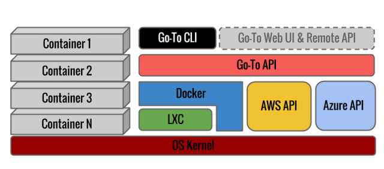

% Go-To: Cloud Provider agnostic OS image migration pipeline
% Leonid Vasilyev, <Leonid.Vasilyev@student.ncirl.ie>
% December 13, 2013

#Project Summary
## Problem Statement
Different Public Cloud Providers have different and not interoperable configuration and format of Guest OS images.
This causes a “Vendor Lock-in” effect.

In case of linux system configuration of Guest OS is different for Amazon Ec2 and Windows Azure.
After performing a snapshot of a live system it's not possible to resume this image in different cloud
provider or in your local environment.
The image will not boot unless you use the same hypervisor with identical configuration.

It is a potential risk for every business operating in the Public Cloud at IaaS level.
For Hybrid Cloud deployments the above aspect causes an operational complexity.
An owner of a hybrid setup must maintain separate OS configuration for its Private and Public parts of infrastructure.
In critical scenarios such as a company or organization required to switch from one Public Cloud provider to another
time and engineering effort should be spent to create a new configuration and deployments for a new cloud infrastructure.

## Project Goal
Provide an automated migration pipeline for OS images between different Cloud Providers.
Develop a threat model, analyse related security risks and mitigation techniques.

## In Scope

* Amazon AWS and Windows Azure Public Cloud providers are used
* Ubuntu Linux 12.04 LTS is used in this project as a Guest OS
* Vagrant on top of VirtualBox is used as a local Private Cloud
* Docker is used to manage Linux Containers in the Guest OS
* VPN tunnel between Cloud Providers is used to transfer OS images.

#Design
## Evaluating options
Historically two main approached applied to provide reproducible and consistent configuration of OS:

* Configuration Management Systems
* Hardware Virtualization
* System Virtualization

Below is a comparison of Pros and Cons of both approaches.

###Configuration Management Systems
These systems began to appear in mid 90-x. CFEngine, Puppet and Cheff are most widely used today.

####Pros
- Zero overhead. All changes are applied to OS directly as soon as possible.

- Ability to apply fine grained changes to live system without stopping a service.

- Domain Specific Languages (DSL) are used for configuration. Which allow a great degree of flexibility.

####Cons
- System configuration is performed via a large amount of small iterative changes.
  The system is "eventually" transformed into a desired state.

- Changes are not atomic. If system is restarted on the middle of applying change process. There is no guarantee that configuration of system will be resumed from last point

- Lack of built-in check pointing. Although it's possible with some file-system performed on-line backups.

- No clean roll-back procedure. Roll-back is add hoc usually done via executing different set of commands on the system

- Additional software is required to operate on a target system; usually it's a background process running under privileged uses. Which causes a security risk.

###Hardware Virtualization

####Pros
- Live migration. It's possible to perform a live migration of the system by suspending it's state

####Cons
- High overhead. Unless paravirtualized every subsystem has a degraded performance
- Nested virtualization is not possible. Only Linux KVM support nested virtualization. 

###System Virtualization
In System virtualization, every application or a group of applications is isolated from each other but running in the same kernel. 

####Pros
- It's possible to use it on top of hardware virtualization
- Changes to the system are atomic
- Clean rollback. Just revert to the previous version of a container
- It's possible to run multiple versions of the same container on the system
- Low overhead abstraction.
  All functionality is implemented in a kernel by settings attributes to different internal data-structures.

####Cons
- No live migration. Before creating a snapshot all processes should be in running container must be frozen. There is some on-going development in this area.

## Chosen design
The System Virtualization approach was chosen for this project because of the combination of combination of the following characteristics:

* Low over-heaed. Compared to full hardware virtualization
* Atomicity of changes. Unlike Configuration Management systems.
* Snapshotting & migration support.
  Container is just a directory on disc and can ve streamed over the network easily.

In fact, all three approached described above may complement each other.
In the cloud environment hardware virtualization is always used and mandatory.
Configuration systems still can be used in a limited fashion to synchronize configuration files and apply changes and patches to a parent system (i.e. the system on top of which containers are run)

#Implementation of Private Cloud

Because the project doesn't require separate Private Cloud infrastructure to build a Hybrid Solution.
VirtualBox is used as a development platform to "inject" initial containers in the Hybrid Solution (Amazon AWS Ec2 + Windows Azure VM)

Vagrant is used to orchestrate configuration of VMs.
Vagrant provides a rich API for configuring and automatically provisioning VMs.
Configuration is described via `Vagrantfile` which is written in Ruby.

Docker is used for managing containers inside VM.
It provides similar configuration language via `Dockerfile` and provided an API on top of
LXC toolkit – which is a low-level API for creating containers.

Using `Vagrant` and `Docker` significantly simply and reduce time for a setup.
As well as provide reproducible set up.

##Detailed steps to set up development environment

__Install VirtualBox-4.3.4__

  * Download package for your OS from <http://download.virtualbox.org/virtualbox/4.3.4/>
  * Follow instruction for your OS to install: <https://www.virtualbox.org/manual/ch02.html>

__Installing Vagrant-1.3.5__

  * Download and execute package for your OS from <http://downloads.vagrantup.com/tags/v1.3.5>

__Configuring Vagrant to run Docker-0.7.1__ 

    export GOTO_WORKSPACE=$(pwd)/$USER-goto-workspace
    mkdir $GOTO_WORKSPACE
    cd $GOTO_WORKSPACE
    
Docker provided pre configuration for Vagrant

    wget --no-check-certificate \
    "https://github.com/dotcloud/docker/raw/v0.7.1/Vagrantfile" \
    -O Vagrantfile
    
Start VM and SSH to it

    vagrant up
    vagrant ssh
    
This command will bring you to VM shell
    
Commands below are executed in VM shell.

Enable swap limit support. This is not enabled by default.

    sudo sed -i \
    's/GRUB_CMDLINE_LINUX="\
    "/GRUB_CMDLINE_LINUX="cgroup_enable=memory swapaccount=1"/' \
    /etc/default/grub
    
Activate changes

    sudo update-grub
    sudo reboot
    
Check Docker status

    sudo docker info
    
Output should look like this:

    Containers: 0
    Images: 0
    Driver: aufs
    Root Dir: /var/lib/docker/aufs
    Dirs: 0
    
VM is configured to run containers. Exit the VM shell

    exit 

## Out of Scope
The above setup was only tested on MacOSX 10.8.5.
The above setup can be automated via Vagrant Provisioning API:
<http://docs.vagrantup.com/v2/provisioning/basic_usage.html>

#Provisioning of Public Cloud

Amazon Ec2 and Windows Azure are evaluated in this section.
The goal is to create VM instances in both clouds in a private network.
Link these two networks via a VPN tunnel.

##Taken steps to set up instances

Source code of scripts to automate instance creation is provided in Appendix A and Appendix B.

Main findings:

### Amazon Ec2
* The process is well documented and there a lot of examples available for different automation options.

* When working under particular IAM used under one account it's possible to access credentials and keys of other IAM users.
  Which is a potential security risk.

* Certificates must be uploaded in every region endpoints separately. This complicates the setup in multi-region environments.

### Windows Azure
* Lack of examples on how automatically provision an instance with a linux OS.

* The Python client API provided by Microsoft is very poorly documented in incomplete.
  Some API calls are missing. Some are completely undocumented.

* Support for linux Guest OS is redementary.
  I was unable to find a way to upload an SSH certificate instead of using plain text passwords in my script.

* Some limits are non-practical. For example: It's only possible to upload 10 management certificates per cloud service.

##Monitoring options
### Amazon AWS

* Amazon has feature rich monitoring service – CloudWatch. It possible to emit custom metrics to Cloud Watch and build alarming or trigger scaling on top of there metrics.

* Very important feature of CloudWatch is support for backfilling of metrics.
  CloudWatch honours the timestamp which provided during the API Call PutMetrics:
  <http://docs.aws.amazon.com/AmazonCloudWatch/latest/APIReference/API_PutMetricData.html>.
  This enabled consistent stream fo metrics without gaps.

* Maximum resolution of metrics is 1 minute.

#### Windows Azure

* Built-in monitoring into Cloud Service

* Documentation is Windows specific. API not exposed and documented in Python Client

* Maximum resolution is 5 minute.
  That means it's hard to use this monitoring for troubleshooting but appropriate for capacity planning.

#Implementation of Hybrid Cloud

Hybrid solution is built on top of Amazon Ec2 and Windows Azure.

##Architecture Overview
Go-to in a central part in this architecture it enables dynamic and automated migration of containers
between cloud providers over secure VPN tunnel.

## Go-To Stack
Go-To relies on Docker as a way to communicate with containers. And on APIs for cloud provider to communicate with it's services.

###Go-To CLI options

    $ go-to --help
    Usage: go-to <CMD> <OPTIONS>
    Available Commands:
     - show-log [-s <time_since>] [-t <time_till>]: show autid log
     - list-containers [regexp_pattern]: show all containers whose name matches with provided regexp
     - migrate [-async] -s <source_name> [-t <target_name>] <target_host_or_ip>:
       Perform migration. This command can be synchronus or asynchonous. In both cases migration_id
       is written to log and to stdout.
     - rollback <migration_id>: Roll back migration with given id
               

## Migration

Transfer of container is performed in few steps:

- Freeze container which a suject to transfer
- Dump its contents to disk in tar.gz archive
- Sign & encrypt container with a x509 certificate
- Connect to remote Go-To Agent
- Remote Go-To agent perform a tocken verification
- Remote Go-To agent checks disk space and other resources
- Data in streamed over TCP socket to target host
- Remote agent unpacks the container archive & activates it

## Network Features

VPN tunnel between Amazon Ec2 and Windows Azure is used for communication.

Configuration of VPC is based on <http://aws.amazon.com/articles/0639686206802544>.
This scheme is flexible and allows connections from development environemnt.

# Demonstration of dynamic characteristics
## Migration
  
# References
## Web resources

<http://lwn.net/Articles/524952/>

<http://michaelwasham.com/2013/09/03/connecting-clouds-site-to-site-aws-azure/>

<http://blog.docker.io/2013/08/containers-docker-how-secure-are-they/>

<https://wiki.ubuntu.com/LxcSecurity>

<http://www.ibm.com/developerworks/linux/library/l-lxc-security/index.html>

<http://marceloneves.org/papers/pdp2013-containers.pdf>

<https://www.kernel.org/doc/Documentation/cgroups/cgroups.txt>

<http://stackoverflow.com/questions/17989306/what-does-docker-add-to-just-plain-lxc>

<http://marceloneves.org/papers/pdp2013-containers.pdf>

##Papers

Menage, Paul B. "Adding generic process containers to the linux kernel." Linux Symposium. 2007.

Xavier, Miguel G., et al. "Performance Evaluation of Container-based Virtualization for High Performance Computing Environments." Parallel, Distributed and Network-Based Processing (PDP), 2013 21st Euromicro International Conference on. IEEE, 2013.

Shea, Ryan, and Jiangchuan Liu. "Performance of Virtual Machines Under Networked Denial of Service Attacks: Experiments and Analysis." (2013): 1-1.

#Appendix A: Scripts to automate creation and configuration of Amazon Ec2

## generate_config.py: Generate configuration to access API

    #!/usr/bin/env python

    '''
    Generate config to access AWS Ec2
    '''

    __author__ = "Leonid Vasilyev, <vsleonid@gmail.com>"

    import base64
    import json
    import os
    import subprocess
    import sys
    import stat

    import boto
    import boto.ec2

    def generate_server_cert(pem, cer):
        if not os.path.exists(pem):
            raise ValueError("{} doesn't exists".format(pem))

        if os.path.exists(cer):
            sys.stderr.write("{} already exists".format(cer))
            return

        cmd = [
            "ssh-keygen",
            "-t",
            "rsa",
            "-y",
            "-f",
            pem
        ]
        with open(cer, "w") as f:
            subprocess.check_call(" ".join(cmd), stdout=f, shell=True)

    def generate_client_cert(pem):
        if os.path.exists(pem):
            sys.stderr.write("{} already exists".format(pem))
            return
        cmd = [
            "openssl",
            "genrsa",
            "1024"
        ]
        with open(pem, "w") as f:
            subprocess.check_call(" ".join(cmd), stdout=f, shell=True)

        os.chmod(pem, stat.S_IREAD | stat.S_IWRITE)

    def main(key, secret, ssh_key_name, ssh_key_dir, config_path):
        ssh_key_dir = os.path.abspath(ssh_key_dir)

        cer = ssh_key_name + ".cer"
        pem = ssh_key_name + ".pem"

        cer_path = os.path.join(ssh_key_dir, cer)
        pem_path = os.path.join(ssh_key_dir, pem)

        config = {
            "access_key_id": key,
            "secret_access_key": secret,
            "certificate_path": pem_path,
        }

        generate_client_cert(pem_path)
        generate_server_cert(pem_path, cer_path)

        all_regions = boto.ec2.regions(
            aws_access_key_id=key,
            aws_secret_access_key=secret)

        with open(cer_path, 'rb') as f:
            cert_data = f.read()

        for region in all_regions:
            print "---"
            print "Importing to:", region.name
            print "---"
            try:
                ec2 = boto.ec2.connect_to_region(
                    region.name,
                    aws_access_key_id=key,
                    aws_secret_access_key=secret)

                ec2.import_key_pair(
                        ssh_key_name,
                        cert_data)

            except Exception as e:
                sys.stderr.write(
                    "Unable to import {} to {}: {}\n".format(
                        ssh_key_name, region.name, e))

        with open(config_path, 'w') as f:
            json.dump(config, f, indent=2)

    if __name__ == "__main__":
        if len(sys.argv) != 6:
            sys.stderr.write(
                "Usage: {} <aws_key>\
                           <aws_secret>\
                           <ssh_key_name> \
                           <ssh_key_dir> \
                           <config_path.json>\n".format(sys.argv[0]))
            sys.exit(1)
        main(*sys.argv[1:])

## check_config.py: Check that generated configuration is valid and display various information from account

    #!/usr/bin/env python

    '''
    Check Ec2 configuration
    '''

    import sys
    import json

    import boto.ec2
    import boto.exception

    def main(config_path):
        config = {}
        with open(config_path) as f:
            config = json.load(f)

        regions = boto.ec2.regions(
            aws_access_key_id=config['access_key_id'],
            aws_secret_access_key=config['secret_access_key']
        )

        print "Ec2 regions:"
        print "-----------"

        for r in sorted(regions, key=lambda o: o.name):
            print "{: <20} https://{}".format(r.name, r.endpoint)

        print ""
        print "Ec2 reservations:"
        print "----------------"

        for reg in regions:
            print ""
            print "Reservaions for {}:".format(reg.name)
            conn = boto.ec2.connect_to_region(
                reg.name,
                aws_access_key_id=config['access_key_id'],
                aws_secret_access_key=config['secret_access_key'])
            try:
                print "\n".join(
                    "  * id:{}\n    owner_id:{}\n    instasnces: {}".format(
                        r.id, r.owner_id,
                        ",".join([i.public_dns_name for i in r.instances]))
                    for r in conn.get_all_reservations())
            except boto.exception.EC2ResponseError:
                pass

            print ""
            print "  Available keypairs:"
            print "  =================="

            try:
                for keypair in conn.get_all_key_pairs():
                    print "   -" + keypair.name
            except boto.exception.EC2ResponseError:
                pass

    if __name__ == "__main__":
        if len(sys.argv) != 2:
            sys.stderr.write("Usage: {} <config.json>\n".format(sys.argv[0]))
            sys.exit(1)
        main(sys.argv[1])

## launch_instance.py: Launch ec2 instance

    #!/usr/bin/env python

    '''
    Start new ec2 instance with open ssh port
    '''

    __author__ = "Leonid Vasilyev, <vsleonid@gmail.com>"

    import json
    import os
    import sys
    import time
    from datetime import datetime

    import boto
    import boto.ec2

    # based on http://cloud-images.ubuntu.com/releases/precise/release/
    INSTANCE_CONFIG = {
        "ami": "ami-14907e63", # Ubuntu 12.04.3 LTS eu-west-1 64-bit instance
        "region": "eu-west-1",
        "type": "m1.small",
    }

    def main(config_path, name_prefix, tag):
        with open(config_path) as f:
            config = json.load(f)

        ec2 = boto.ec2.connect_to_region(
            INSTANCE_CONFIG['region'],
            aws_access_key_id=config['access_key_id'],
            aws_secret_access_key=config['secret_access_key'])

        name = name_prefix + "-" + datetime.utcnow().isoformat()

        # Assume that ssh key is uploaded

        group = ec2.create_security_group(
            name,
            'A group that allows SSH access')
        group.authorize('tcp', 22, 22, "0.0.0.0/0")

        reservation = ec2.run_instances(
                INSTANCE_CONFIG['ami'],
                key_name=os.path.basename(config['certificate_path']).split(".")[0],
                instance_type=INSTANCE_CONFIG['type'],
                security_groups=[name])

        # Find the actual Instance object inside the Reservation object
        # returned by EC2.

        instance = reservation.instances[0]

        # The instance has been launched but it's not yet up and
        # running.  Let's wait for it's state to change to 'running'.

        print 'waiting for instance'
        while instance.state != 'running':
            print '.',
            time.sleep(1)
            instance.update()
        print 'done'

        instance.add_tag(tag)

        print "DoNe! To connect use:"
        print "ssh -i {} ubuntu@{}".format(
            config['certificate_path'],
            instance.public_dns_name
        )

    if __name__ == "__main__":
        if len(sys.argv) != 4:
            sys.stderr.write("Usage:\n {} <config-path>\
                 <name-prefix> <tag>\n".format(sys.argv[0]))
            sys.exit(1)
        main(*sys.argv[1:])

#Appndix B: Scripts to automate creating and configuration of Windows Azure

## generate_config.py: Generate configuration

    #!/usr/bin/env python

    '''
    Generate config for Azure
    '''

    __author__ = "Leonid Vasilyev, <vsleonid@gmail.com>"

    import sys
    import os
    import subprocess
    import json

    def generate_server_cert(pem, cer):
        if not os.path.exists(pem):
            raise ValueError("{} doesn't exists".format(pem))

        if os.path.exists(cer):
            sys.stderr.write("{} already exists".format(cer))
            return

        cmd = [
            "openssl",
            "x509",
            "-in",
            pem,
            "-out",
            cer,
        ]
        subprocess.check_call(" ".join(cmd), shell=True)

    def generate_client_cert(pem):
        if os.path.exists(pem):
            sys.stderr.write("{} already exists".format(pem))
            return
        cmd = [
            "openssl",
            "req",
            "-x509",
            "-nodes",
            "-days",
            "365",
            "-newkey",
            "rsa:1024",
            "-keyout",
            pem,
            "-out",
            pem,
        ]
        subprocess.check_call(" ".join(cmd), shell=True)

    def get_public_key(cer, pubkey):
        cmd = "openssl x509 -in " + cer + " -pubkey -noout"

        subprocess.check_call(cmd, stdout=open(pubkey, "wb"), shell=True)

    def main(subscription_id, api_cert_path, cert_path, config_path):
        api_cert_path = os.path.abspath(api_cert_path)
        cert_path = os.path.abspath(cert_path)
        config_path = os.path.abspath(config_path) 

        if os.path.exists(config_path):
            raise ValueError("{} exists".format(config_path))

        cer = cert_path + ".cer"
        pem = cert_path + ".pem"
        pubkey = cert_path + ".pk"

        generate_client_cert(pem)
        generate_server_cert(pem, cer)
        get_public_key(cer, pubkey)

        config = {}
        config['subscription_id'] = subscription_id
        config['api_certificate_path'] = api_cert_path
        config['certificate_path'] = cer
        config['certificate_pubkey'] = pubkey

        with open(config_path, "w") as f:
            json.dump(config, f, indent=4)

    if __name__ == "__main__":
        if len(sys.argv) != 5:
            sys.stderr.write(
                "Usage: {} <subscription_id> <api_cert_path> <cert_path> <config-name.json>\n".format(sys.argv[0]))
            sys.exit(1)
        main(*sys.argv[1:])

## check_config.py: Check that generated configuration is correct and fetch various information from account

    #!/usr/bin/env python

    '''
    Check access to Azure API
    '''

    __author__ = "Leonid Vasilyev, <vsleonid@gmail.com>"

    import json
    import sys
    import os

    import azure.servicemanagement as smgmt

    def print_locations_and_services(sms):
        print "Available locations & services:"
        print "=============================="

        for i, loc in enumerate(sms.list_locations()):
            print("{}.{}:\n  {}".format(
                i + 1,
                loc.display_name,
                ", ".join(loc.available_services)))

    def print_available_os_images(sms):
        print "Available OS images:"
        print "==================="

        def _by_os_and_label(image):
            return image.os, image.label

        for image in sorted(sms.list_os_images(), key=_by_os_and_label):
            print "{os}: {label} ({size}GB)\n{name}".format(
                os=image.os,
                label=image.label,
                size=image.logical_size_in_gb,
                name=image.name
            )
            print " "

    def print_disks_info(sms):
        print "Disks info:"
        print "=========="

        for disk in sms.list_disks():
            print "{name}({size}GB):\n{source}\n{attached}".format(
                name=disk.name,
                size=disk.logical_disk_size_in_gb,
                source=disk.source_image_name,
                attached=disk.attached_to.hosted_service_name +
                "/" + disk.attached_to.deployment_name
            )
            print " "

    def print_hosted_services(sms):
        print "Hosted Services Info:"
        print "===================="
        for service in sms.list_hosted_services():
            print service.service_name
            for k, v in service.hosted_service_properties.__dict__.iteritems():
                if k.startswith('_'):
                    continue
                print "  {}: {}".format(k, v)

    def main(config_path):
        if not os.path.exists(config_path):
            raise ValueError("'{}' doesn't exists".format(config_path))

        config = {}
        with open(config_path) as f:
            config = json.load(f)

        subscription_id = config['subscription_id']
        certificate_path = config['certificate_path']

        sms = smgmt.ServiceManagementService(subscription_id, certificate_path)

        print "Account summary:"
        print "---------------"
        print_locations_and_services(sms)
        print_available_os_images(sms)
        print_disks_info(sms)
        print_hosted_services(sms)

    if __name__ == "__main__":
        if len(sys.argv) != 2:
            sys.stderr.write(
                "Usage: {} <config-file.json>\n".format(sys.argv[0]))
            sys.exit(1)
        main(sys.argv[1])

## launch_instance.py: Launch instance in Azure with generated configuration

    #!/usr/bin/env python

    '''
    Script to launch Azure VM
    '''

    __author_ = "Leonid Vasilyev, <vsleonid@gmail.com>"

    import json
    import hashlib
    import time
    import os
    import sys
    import base64
    from datetime import datetime

    import azure
    from azure.servicemanagement import *

    INSTANCE_CONFIG = {
        "region": "West Europe",
        "image": "b39f27a8b8c64d52b05eac6a62ebad85__Ubuntu_DAILY_BUILD-precise-12_04_3-LTS-amd64-server-20131205-en-us-30GB",
        "type": "Medium",
    }

    def main(config_path, prefix):
        with open(config_path) as f:
            config = json.load(f)

        name = prefix + "-" + hashlib.md5(datetime.utcnow().isoformat()).hexdigest()

        sms = ServiceManagementService(
            config['subscription_id'],
            config['api_certificate_path'])

        sms.create_hosted_service(
            service_name=name,
            label=name,
            location=INSTANCE_CONFIG['region'])

        cert_data = open(config['certificate_path']).read()
        fingerpring = hashlib.sha1(cert_data).hexdigest().upper()
        sms.add_management_certificate(
            public_key=cert_data,
            thumbprint=fingerpring,
            data=cert_data
        )

        # Try to reuse storage account first
        # becase limit of storage accounts is by default 1.
        storage_accounts = sms.list_storage_accounts()

        if len(storage_accounts):
            storage = storage_accounts[-1]
            # Storage and Service can't be in different regions
            if storage.storage_service_properties.location != INSTANCE_CONFIG["region"]:
                raise ValueError(
                    ("Can't use Storage account from different region: service is in"
                     "{} but storage is in {}").format(
                        INSTANCE_CONFIG["region"],
                        storage.storage_service_properties.location))
            storage_name = storage.service_name
        else:
            storage_name = name.replace("-", "")[:24]

            sms.create_storage_account(
                service_name=storage_name,
                description=storage_name,
                label=storage_name,
                location=INSTANCE_CONFIG['region']
            )

        vhd = OSVirtualHardDisk(
            INSTANCE_CONFIG["image"],
            "http://{service}.blob.core.windows.net/{container}/{blob}.vhd".format(
                service=storage_name,
                container=name,
                blob="os"
            ).lower().replace("_", "-").replace("--", "-")
        )

        linux_config = LinuxConfigurationSet(
            name,
            "ubuntu",
            name, # will not be used
            disable_ssh_password_authentication=True)

        publickey = PublicKey(
            fingerpring,
            "/home/ubuntu/.ssh/authorized_keys") # file on VM
        linux_config.ssh.public_keys.public_keys.append(publickey)

        network = ConfigurationSet()
        network.configuration_set_type = 'NetworkConfiguration'
        network.input_endpoints.input_endpoints.append(
            ConfigurationSetInputEndpoint('ssh', 'tcp', '22', '22'))

        result = sms.create_virtual_machine_deployment(
            service_name=name,
            deployment_name=name,
            deployment_slot='production',
            label=name,
            role_name=name,
            system_config=linux_config,
            os_virtual_hard_disk=vhd,
            network_config=network,
            role_size=INSTANCE_CONFIG['type'])

        print result

        while True:
            status = sms.get_operation_status(result.request_id).status
            if status != u"InProgress":
                print status
                break
            time.sleep(1)
            print ".",

    if __name__ == "__main__":
        if len(sys.argv) != 3:
            sys.stderr.write("Usage: {} <config-path.json> <name-prefix>\n".format(sys.argv[0]))
            sys.exit(1)
        main(*sys.argv[1:])
