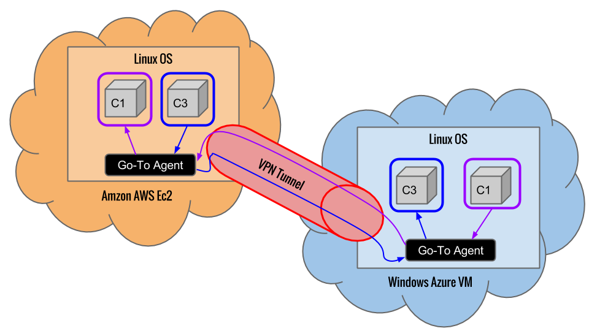
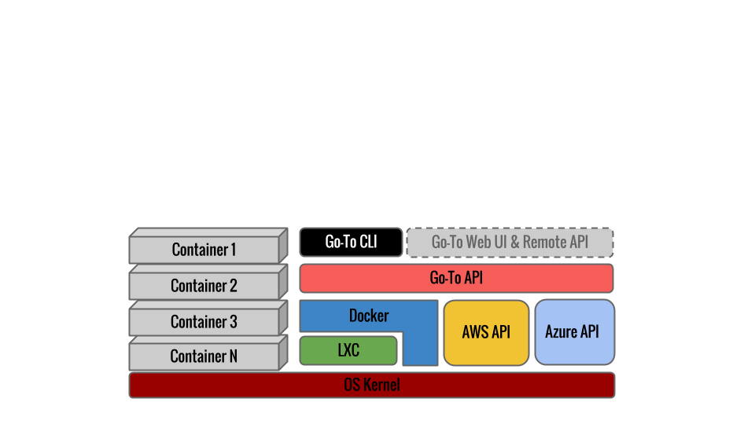

#Project Summamry

#Design
## Evaluating options
### Pros
### Cons
## Choosen design
### Why?

#Implementation of Private Cloud
*The following guide is for Unix-like OS types.*

VirtualBox used as a local virtual development environment.
Vagrant used to orchestrate configuration of VMs.

Follow these steps to complete the setup.

__Install VirtualBox-4.3.4__

  * Download package for your OS from http://download.virtualbox.org/virtualbox/4.3.4/
  * Follow instruction for yous OS to install: https://www.virtualbox.org/manual/ch02.html

__Installing Vagrant-1.3.5__

  * Download and execute package for your OS from http://downloads.vagrantup.com/tags/v1.3.5

__Configuring Vagrant to run Docker-0.7.1__ 

    # this directory will only keep configuration for Vagrant. Image data stred separately
    export GOTO_WORKSPACE=$(pwd)/$USER-goto-workspace
    mkdir $GOTO_WORKSPACE
    cd $GOTO_WORKSPACE
    
    # Docker provided pre configuration for Vagrant
    wget --no-check-certificate "https://github.com/dotcloud/docker/raw/v0.7.1/Vagrantfile" -O Vagrantfile
    
    # Start VM and SSH to it
    vagrant up
    vagrant ssh # <-- this command will bring you to VM shell
    
    # !!! COMMANDS BELOW ARE EXECUTED IN VM !!!
    
    # Enable swap limit support. This is not enabled by default.
    sudo sed -i 's/GRUB_CMDLINE_LINUX=""/GRUB_CMDLINE_LINUX="cgroup_enable=memory swapaccount=1"/' /etc/default/grub
    
    # Activate changes
    sudo update-grub
    sudo reboot
    
    # Check Docker status
    sudo docker info
    
    # Output should look like this:
    Containers: 0
    Images: 0
    Driver: aufs
    Root Dir: /var/lib/docker/aufs
    Dirs: 0
    
    # Congratulations! Your VM is configured to run containers. Exit the VM shell
    exit 

This guide is partially based on official Docker guide: http://docs.docker.io/en/latest/installation/

## Out of Scope
The above setup was tested on MacOSX 10.8.5

#Provisioning of Public Cloud
##Taken steps
##Monitoring options

#Implementation of Hybrid Cloud
##Architecture Overview

## Go-To Stack

## Migration

## Network Features

# Demonstration of dynamic characteristics
## Migration
  
# References
http://michaelwasham.com/2013/09/03/connecting-clouds-site-to-site-aws-azure/

