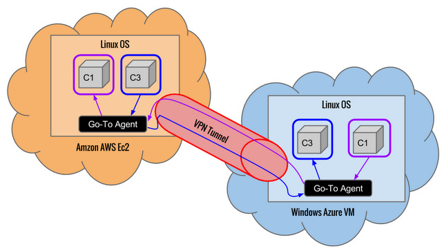

% Go-To: Cloud Provider agnostic system migration pipeline. Security Analisys.
% Leonid Vasilyev, <Leonid.Vasilyev@student.ncirl.ie>
% December 13, 2013

#Project Summary
## Problem Statement
Different Public Cloud Providers have different and not interoperable configuration and format of Guest OS images.
This causes a “Vendor Lock-in” effect.

In case of linux system configuration of Guest OS is different for Amazon Ec2 and Windows Azure.
After performing a snapshot of a live system it's not possible to resume this image in different cloud
provider or in your local environment.
The image will not boot unless you use the same hypervisor with identical configuration.

It is a potential risk for every business operating in the Public Cloud at IaaS level.
For Hybrid Cloud deployments the above aspect causes an operational complexity.
An owner of a hybrid setup must maintain separate OS configuration for its Private and Public parts of infrastructure.
In critical scenarios such as a company or organization required to switch from one Public Cloud provider to another
time and engineering effort should be spent to create a new configuration and deployments for a new cloud infrastructure.

## Project Goal
Provide an automated migration pipeline for OS images between different Cloud Providers.
Develop a threat model, analyse related security risks and mitigation techniques.

## In Scope

* Amazon AWS and Windows Azure Public Cloud providers are used
* Ubuntu Linux 12.04 LTS is used in this project as a Guest OS
* Vagrant on top of VirtualBox is used as a local Private Cloud
* Docker is used to manage Linux Containers in the Guest OS
* VPN tunnel between Cloud Providers is used to transfer OS images.

## Architectire Overview

# Security analysis
## Approach & Planning

[detailing the approach you have taken to implement security across the system in question
and a project plan specifying the tasks
and dependencies associated with the implementation of security]

Microsoft Threat Modeling Process was used for threat modeling.
It has the following stages:

1. Identify Security Objectives
2. Perform an application design overview
3. Perform a decomposition
4. Identify Threats
5. Identify Vulnerabilities

STRIDE was used to perform a decomposition of a system.
DREAD was used to perform a ranking of found security threats.

## Selection of Tools, Methodologies and Frameworks for Security Testing

[documentation of choice of toolset utilised as part of the security implementation
including rationale for choice, level of default security provision,
and the manner in which you have further hardened the system.]

I picked Microsoft Threat Modeling Process because it's very practical and well documented.
It suggests using STRIDE and DREAD which are also very practical compared to OCTAVE or CVSS.

## Technical Testing Approach

[documentation of process involved in testing the security that has been implemented.]

## Findings & Risk Rating

[presentation of findings from testing and assignment of an appropriate risk ratings
with respect to the developed system.]

## Challenges & Limitations

[highlight any areas of the system that may be vulnerable to attack
or those areas that require further investigation
and analysis to ascertain the system’s level of vulnerability.]

The main challenge is that it's impossible at IaaS level indetify few major Security Objectvies
such as Indentity Abuse, Privacy, Financial Regulations and Reputation risks.
These objectives should be managed at SaaS level.

## Outcome

[synopsis of results and outcome of project.]

## Conclusion

System Virtualization opens up new possibilities for auditing applications at IaaS level,
inspecting activity and provide a fine grain mechanish to control resource consumption.
System Virtualization also creates an opprotunities for Cloud Brokers and Cloud Auditors
(for definitions see "NIST Reference Architecture").
On the other hand it's not widely used in production deployments yet
(there some early adopters - usually PaaS providers).
Security is a major part of System Virtualization infrastructure,
but to configure it properly one must have a deep understandings of a particular system's internals.
Nevetheless System Vitualization might be de-facto standard for deploing systems in the Public Cloud
as it allows to avoid Vendor Lock-In effect at Operating System level.

## References

### Papers

Jansen, Wayne, and Timothy Grance. "Guidelines on security and privacy in public cloud computing." NIST special publication (2011): 800-144.

Liu, Fang, et al. "NIST cloud computing reference architecture." NIST special publication 500 (2011): 292.

Brunette, G., and R. Mogull. "Security Guidance for critical areas of focus in Cloud Computing V3.0. CSA (Cloud Security Alliance), USA (2011)."

### Web resources

http://msdn.microsoft.com/en-us/magazine/cc163519.aspx

https://www.owasp.org/index.php/Threat_Risk_Modeling#Identify_Threats
